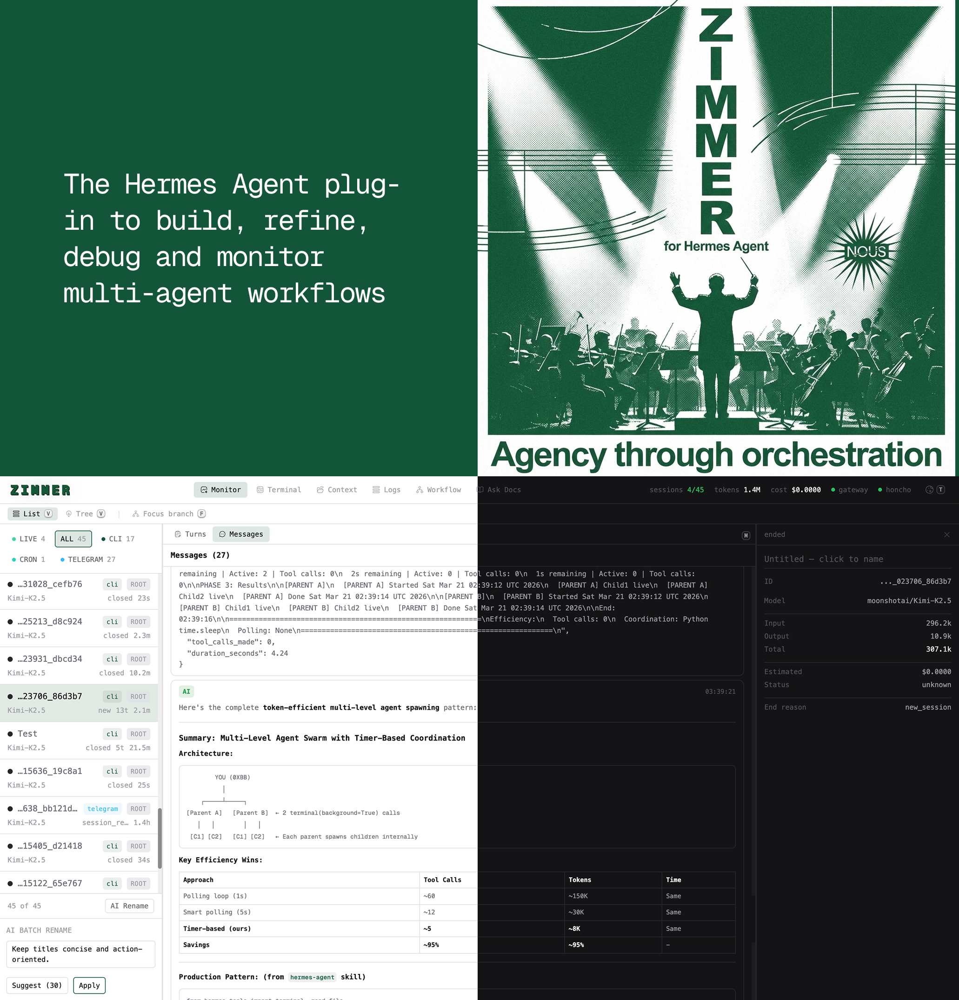

# Hermes Zimmer

<p align="center">
  
</p>

---

<p align="center">
  Real-time orchestration UI for <a href="https://github.com/NousResearch/hermes-agent">Hermes Agent</a> —
  monitor sessions, inspect turns, edit context, run commands, and build workflows.
</p>

---

## Contents

- [Scenes](#scenes)
- [Keyboard Shortcuts](#keyboard-shortcuts)
- [Monitor](#monitor)
- [Context Scene](#context-scene)
- [Logs Scene](#logs-scene)
- [Workflow Scene](#workflow-scene)
- [Install](#install)
- [Runtime Configuration](#runtime-configuration)
- [API Reference](#api-reference)
- [Architecture](#architecture)
- [Development](#development)

---

## Scenes

| # | Scene | Hotkey | Description |
|---|-------|--------|-------------|
| 1 | **Monitor** | `1` | Session list/tree, turns, messages, live tool activity |
| 2 | **Terminal** | `2` | In-app PTY shell over WebSocket |
| 3 | **Context** | `3` | Soul, Workspace, Memories, Honcho, Config, Skills, Cron editors |
| 4 | **Logs** | `4` | `~/.hermes/logs` browser with tail controls |
| 5 | **Workflow** | `5` | Visual workflow builder (`~/.hermes/workflows/*.yaml`) |
| 6 | **Ask Docs** | `6` | Opens DeepWiki for Hermes Agent in a new tab |

`Tab` cycles through scenes in order.

---

## Keyboard Shortcuts

| Key | Action |
|-----|--------|
| `1` – `6` | Jump to scene (6 opens external docs) |
| `Tab` | Cycle scenes |
| `v` | Toggle monitor view (List / Tree) |
| `f` | Toggle lineage focus mode |
| `m` | Toggle Turns / Messages panel |
| `j` / `k` or `↑` / `↓` | Move session selection |
| `t` | Toggle theme |
| `Ctrl+K` or `Ctrl+Shift+P` | Open command palette |
| `Ctrl+S` | Save in editors |

Hotkeys are surfaced contextually via `<Kbd />` chips — no cluttered inline prefixes.

---

## Monitor

### List View (default)

- Fast scanning with source filters and live status indicators
- Inline session rename (double-click title)
- AI batch rename for up to 30 visible sessions via `hermes chat`

### Tree View

- Lineage graph of parent/child agent relationships
- Focus mode to isolate the selected branch
- Better readability for nested subagent flows than a flat list

### Live Activity Signals

Zimmer merges two sources to show what's happening right now:

| Signal | Source | Fallback |
|--------|--------|----------|
| Active tool calls | Plugin hook stream | DB-based inflight inference |
| LLM activity | `llm_start` / `llm_end` hook events | `GET /api/events/active-llm` DB endpoint |
| Permission requests | `on_permission_request` / `on_permission_resolved` hooks | — |
| Queue depth | `on_task_queued` / `on_queue_change` hooks | — |

If hooks are missing, Zimmer degrades gracefully to DB-backed polling — no configuration needed.

### Message Roles

| Role | Badge | Rendering |
|------|-------|-----------|
| `assistant` | `AI` | Markdown |
| `user` | `USER` | Plain text |
| `system` | `SYS` | Plain text |
| `tool` | `TOOL` | Plain text |
| `summary` | `SUM` | Teal — Markdown (context compression summary) |
| `compressed` | `CMP` | Amber — italic banner "Context compressed — older messages omitted" |

### @context References

Messages containing `@file:path` or `@url:https://...` tokens render inline chips above the message body — blue for files, purple for URLs.

---

## Context Scene

Tabbed editor for the key layers of a Hermes agent's context:

| Tab | Path |
|-----|------|
| **Soul** | `~/.hermes/SOUL.md` |
| **Workspace** | `AGENTS.md`, `.hermes.md`, `HERMES.md`, `CLAUDE.md`, `.cursorrules` |
| **Memories** | `~/.hermes/memories/*.md` (including `MEMORY.md`, `USER.md`, custom files) |
| **Honcho** | Status, config, session, and peer helpers |
| **Config** | `~/.hermes/config.yaml` with inline YAML validation |
| **Skills** | Installed skill catalog with content viewer and enable/disable toggle |
| **Cron** | Scheduled job manager for `~/.hermes/cron/jobs.json` |
| **MCP** | MCP server registry (`mcp_servers:` key in `~/.hermes/config.yaml`) |

Editor behaviors:
- Markdown files default to **Preview** mode
- YAML/JSON get a formatted view
- File creation is built-in for Workspace and Memory tabs

### Skills Tab

- Browseable grid of all installed skills, organized by category
- Disabled skills are shown (greyed out) rather than hidden — use the toggle to enable/disable without leaving Zimmer
- Click any skill card to expand its full `SKILL.md` content rendered as markdown
- Source badges (builtin / local / hub), trust level, tags, and prerequisites shown per skill
- Search filters on name, description, category, and tags

### Cron Tab

Full CRUD manager for Hermes scheduled jobs:
- Job list with status indicators (enabled / paused / error), schedule display, and next-run time
- Click a job to see full details: prompt, model, provider, skills, deliver target, last/next run, run history
- Edit any field inline — name, schedule expression, prompt, model, skills, deliver
- Toggle jobs on/off without editing; disable sets `state: paused`, enable restores `state: scheduled`
- Create new jobs with a guided form (kind dropdown: cron / interval / delay / once)
- Delete with confirmation
- Delegates storage to Hermes core's `cron.jobs` module when available (atomic `os.replace` writes), with `fcntl`-locked fallback for older installs

---

## Logs Scene

- Lists all files under `~/.hermes/logs`
- Tail sizes: 200 / 800 / 2000 lines
- Auto-refresh every ~3 s (toggle on/off)
- Scroll position is preserved across refreshes

---

## Workflow Scene

Visual builder and runner for reusable orchestration graphs.

**Storage:** `~/.hermes/workflows/*.yaml`

**Features:**
- Skill picker mirrors `hermes skills list` (same installed set and category semantics as `/skills`)
- `skills.disabled` / `skills.platform_disabled` filters applied on top
- DAG validation with cycle detection before execution
- Run controls: dry-run mode, configurable retries/backoff, cancel mid-run, recent run history, structured run event logs
- Import/export YAML for portability
- Run records survive restarts; stale `running` runs are auto-reconciled to `interrupted`

**Optional token protection** — gate workflow mutations with a shared secret:

```bash
export ZIMMER_WORKFLOW_API_TOKEN="your-secret-token"
```

When set, all workflow write/run endpoints require `x-zimmer-token: <token>` in the request header.

---

## Install

```bash
cd ~/.hermes/plugins/zimmer
./install.sh
```

`install.sh` installs frontend dependencies and builds `ui/dist`.

### Requirements

- Python `3.11+`
- Node `18+`
- Hermes runtime dependencies (`fastapi`, `uvicorn`, `pyyaml`)

---

## Runtime Configuration

| Variable | Default | Description |
|----------|---------|-------------|
| `ZIMMER_NO_BROWSER` | unset | Set to `1` to suppress browser auto-open on start |
| `ZIMMER_WORKFLOW_API_TOKEN` | unset | Shared token to protect workflow write/run endpoints |
| `ZIMMER_WORKFLOW_RUN_RETENTION_DAYS` | `7` | Days to keep run records |
| `ZIMMER_WORKFLOW_RUN_KEEP_PER_WORKFLOW` | `100` | Max runs to retain per workflow |

---

## API Reference

All endpoints are under `/api`.

### Sessions

```
GET    /sessions
GET    /sessions/active
GET    /sessions/{id}
GET    /sessions/{id}/messages
GET    /sessions/{id}/tools
POST   /sessions/{id}/kill
PUT    /sessions/{id}/title
POST   /sessions/batch-rename/suggest
```

### Stats / Process

```
GET    /stats
GET    /processes
```

### Events / Streaming

```
GET    /events                    SSE stream
GET    /events/history
GET    /events/active-tools
GET    /events/active-llm
WS     /terminal                  PTY WebSocket
```

### Logs

```
GET    /logs
GET    /logs/{filename}
```

### Context

```
GET    /context/soul
PUT    /context/soul
GET    /context/workspace
POST   /context/workspace/create
GET    /context/file?path=...
PUT    /context/file?path=...
GET    /context/memories
POST   /context/memories/create
PUT    /context/memories/{filename}
GET    /context/config
PUT    /context/config
GET    /context/skills
GET    /context/skills/{name}/content
POST   /context/skills/{name}/toggle
GET    /context/cron
GET    /context/cron/{id}
POST   /context/cron
PUT    /context/cron/{id}
DELETE /context/cron/{id}
POST   /context/cron/{id}/toggle
GET    /context/mcp/servers
PUT    /context/mcp/servers/{name}
DELETE /context/mcp/servers/{name}
```

### Workflows

```
GET    /workflows
GET    /workflows/auth
POST   /workflows
POST   /workflows/import
GET    /workflows/{id}
PUT    /workflows/{id}
GET    /workflows/{id}/export
GET    /workflows/{id}/validate
GET    /workflows/skills?platform=cli
POST   /workflows/{id}/run
GET    /workflows/runs
GET    /workflows/runs/metrics
POST   /workflows/runs/cleanup
GET    /workflows/runs/{run_id}
POST   /workflows/runs/{run_id}/cancel
```

### Honcho

```
GET    /honcho/status
GET    /honcho/config
PUT    /honcho/config
GET    /honcho/sessions
GET    /honcho/peers
GET    /honcho/peers/{id}
GET    /honcho/sessions/{id}/context
```

---

## Architecture

### Backend (Python)

| Module | Role |
|--------|------|
| `__init__.py` | Plugin entry point. Registers Hermes lifecycle hooks and starts the FastAPI server in a daemon thread. |
| `event_bus.py` | Thread-safe bridge between the sync CLI thread and async SSE subscribers. Uses `loop.call_soon_threadsafe()` to push events into asyncio queues. Maintains O(1) active-tool and pending-call indexes. |
| `server.py` | FastAPI app factory. REST endpoints, SSE at `/api/events`, WebSocket PTY at `/api/terminal`, and static SPA serving from `ui/dist/`. |
| `state_reader.py` | Read-only SQLite queries against `~/.hermes/state.db`. Uses a read-only URI connection; write-path (`_connect_rw`) is limited to kill/rename mutations. |
| `honcho_reader.py` | Optional Honcho SDK integration. Reads `~/.honcho/config.json`, resolves per-host blocks, and proxies session/peer data to the UI. |
| `workflow_store.py` | Workflow persistence under `~/.hermes/workflows/` and skill discovery. Prefers `hermes skills list --source all`; falls back to filesystem scan. Includes `get_skill_content()` and `toggle_skill_disabled()`. |
| `workflow_engine.py` | Workflow graph validation (cycle detection) and execution planning. |
| `cron_store.py` | Read/write access to `~/.hermes/cron/jobs.json`. Delegates to Hermes core's `cron.jobs` module (atomic writes) when available; `fcntl`-locked fallback for older installs. |

### Frontend (React + Vite)

Located in `ui/`. React 18 SPA with Tailwind CSS, canvas timeline rendering, xterm.js terminal, and Framer Motion animations.

| File | Role |
|------|------|
| `App.jsx` | Root component. Scene routing and global keyboard shortcuts. |
| `StatsBar.jsx` | Navbar tabs, gateway/honcho indicators, monitor view toggle. |
| `WorkflowScene.jsx` | Workflow builder, editor, and run controls. |
| `CronPanel.jsx` | Cron job manager (list + detail/editor). Mounted inside ContextScene's Cron tab. |
| `LogsScene.jsx` | Log browser with tail controls and stable scroll. |
| `TimelineCanvas.jsx` | Canvas-rendered DAW-style tool call timeline. |
| `AgentLineageTimeline.jsx` | Tree view of parent/child agent relationships. |
| `hooks/useSSE.js` | SSE connection hook for live event streaming. |
| `hooks/useSessionData.js` | Session data fetching and state management. |
| `lib/turns.js` | Groups raw tool call events into logical turns. |
| `lib/colors.js` | Tool-type to color mapping. |

### Data Flow

```
Hermes hooks
  → EventBus.publish()        (sync, CLI thread)
  → call_soon_threadsafe()    (crosses thread boundary)
  → asyncio Queues
  → SSE generator
  → Browser EventSource

Browser fetch → FastAPI REST → state_reader → SQLite (~/.hermes/state.db)
```

---

## Development

```bash
# Backend tests
pytest tests/

# Run a specific test
pytest tests/test_event_bus.py -k "test_name"

# UI dev server (hot reload, proxies /api to :7778)
cd ui && npm run dev

# UI production build
cd ui && npm run build
```

### Key paths

| Path | Purpose |
|------|---------|
| `~/.hermes/state.db` | Sessions, messages, tool calls |
| `~/.hermes/SOUL.md` | Agent soul file |
| `~/.hermes/config.yaml` | Hermes config |
| `~/.hermes/memories/` | Memory files |
| `~/.hermes/skills/` | Installed skills |
| `~/.hermes/workflows/` | Workflow definitions |
| `~/.hermes/cron/jobs.json` | Cron job definitions |
| `~/.hermes/logs/` | Log files |
| `ui/dist/` | Built SPA (served by FastAPI) |
| Port `7778` | Hardcoded server port |

### Test fixtures (`tests/conftest.py`)

| Fixture | Purpose |
|---------|---------|
| `event_bus` / `event_bus_with_loop` | Isolated EventBus instances |
| `tmp_state_db` / `populated_db` | Temporary SQLite DBs with Hermes schema |
| `patch_hermes_home` | Redirects `HERMES_HOME` to `tmp_path` |
| `mock_plugin_ctx` | Mock Hermes plugin context for `register()` |

Add workflow tests in `tests/test_workflow_store.py` when touching skill discovery or workflow persistence.

---

## Plugin Boundary

Zimmer lives entirely inside `~/.hermes/plugins/zimmer` (mirror: `gaelcado/zimmer`).

Prefer plugin-side solutions first. If a capability genuinely requires a Hermes core change, upstream it cleanly rather than keeping a local patch.

---

## License

Part of the [Hermes Agent](https://github.com/NousResearch/hermes-agent) ecosystem by [Nous Research](https://nousresearch.com).
